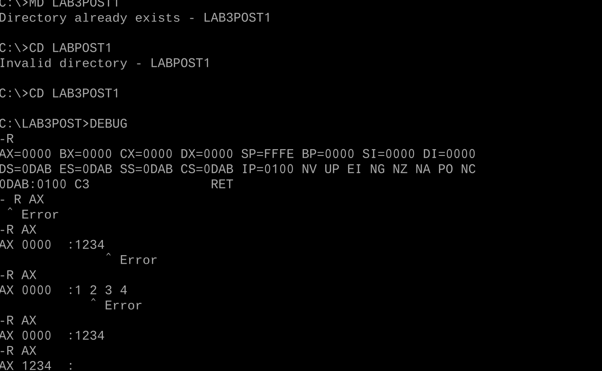

# Laboratorio: Exploración con DEBUG en DOSBox
**Arquitectura de Computadores — Unidad 3: Manejo del DEBUG**  
**Post-Contenido 1 | Ingeniería de Sistemas | UFPS | 2026**

---

## Propósito del laboratorio

El presente laboratorio tiene como objetivo configurar el entorno DOSBox, acceder al depurador DEBUG y utilizar los comandos `R`, `D`, `F` y `U` para inspeccionar el estado inicial de los registros del procesador, rellenar y volcar bloques de memoria, y desensamblar código máquina en instrucciones ensamblador legibles. La actividad permite comprender cómo el procesador 8086 organiza su estado interno y cómo el modo real de x86 no distingue entre regiones de código y datos en memoria.

---

## Estructura del repositorio

```
apellido-post1-u3/
├── README.md
└── capturas/
    ├── CP1_registros.png
    ├── CP2_volcado_memoria.png
    └── CP3_ensamblado_desensamblado.png
```

---

## Parte A — Configuración del Entorno DOSBox

Se abrió DOSBox y se montó la carpeta de trabajo del sistema anfitrión como unidad `C:` virtual:

```
Z:\> MOUNT C C:\DOSWork
Drive C is mounted as local directory C:\DOSWork\
Z:\> C:
C:\> MD LAB3POST1
C:\> CD LAB3POST1
C:\LAB3POST1> DEBUG
-
```

La carpeta `LAB3POST1` se creó para aislar los archivos generados durante esta sesión. El prompt `-` confirma que DEBUG inició correctamente.

---

## Parte B — Inspección de Registros con R

### Comandos ejecutados

```
-R
-R AX
:1234
-R
```

### Checkpoint 1 — Estado de registros



### Observaciones

Al ejecutar `R` sin argumentos, DEBUG muestra el estado completo del procesador: los cuatro registros de propósito general (`AX`, `BX`, `CX`, `DX`) aparecen inicializados en `0000`; el puntero de pila `SP` apunta a `FFFE`, que corresponde al tope inicial de la pila en el segmento asignado; los cuatro registros de segmento (`DS`, `ES`, `SS`, `CS`) comparten el mismo valor de párrafo, que es el segmento del PSP asignado por DOS al proceso. El `IP` vale `0100`, que es la primera dirección ejecutable después de los 256 bytes del PSP.

Al ejecutar `R AX` y asignar el valor `1234`, se verificó que la modificación es selectiva: únicamente `AX` cambia su contenido a `1234h` (4660 decimal) y el resto de los registros permanece sin alteración. Esto confirma que DEBUG opera directamente sobre el estado del procesador sin efectos secundarios en otros registros.

---

## Parte C — Volcado de Memoria con D y Relleno con F

### Comandos ejecutados

```
-F 200 L40 AB CD EF
-D 200 L40
-D 0 L20
```

### Checkpoint 2 — Volcado hexadecimal


### Observaciones

**Columnas de la salida del comando D:**  
La salida del comando `D` se organiza en tres columnas. La primera columna indica la dirección lógica en formato `segmento:desplazamiento` (p. ej., `1357:0200`), que permite ubicar exactamente cada byte dentro del espacio de memoria del proceso. La segunda columna muestra 16 bytes en hexadecimal separados por un guión central que divide el bloque en dos grupos de 8 bytes, facilitando la lectura de posiciones relativas. La tercera columna presenta la representación ASCII de esos mismos 16 bytes; los valores fuera del rango imprimible `0x20–0x7E` se sustituyen por un punto (`.`), razón por la cual el patrón `AB CD EF` aparece como puntos en esa columna.

El patrón `AB CD EF` se repite cíclicamente en las cuatro filas del volcado, cubriendo los 64 bytes (`L40`) a partir de `DS:0200`. La exploración del PSP con `D 0 L20` reveló que los primeros dos bytes son `CD 20`, correspondientes a la instrucción `INT 20`, que DOS coloca allí como mecanismo de terminación de emergencia para programas COM.

---

## Parte D — Desensamblado con U y Ensamblado con A

### Comandos ejecutados

```
-U 100 L10
-A 100
1357:0100 MOV AX, 0005
1357:0103 MOV BX, 0003
1357:0106 ADD AX, BX
1357:0108 INT 20
1357:010A
-U 100 109
```

### Checkpoint 3 — Ensamblado y desensamblado


### Observaciones

El comando `U 100 L10` sobre el estado inicial mostró que a partir de `CS:0100` solo existe `INT 20` (`CD 20`) seguido de bytes cero, los cuales DEBUG decodifica como `ADD [BX+SI],AL`. Este comportamiento evidencia un principio fundamental de la arquitectura x86 en modo real: no existe distinción entre código y datos; el procesador interpreta como instrucción cualquier byte al que apunte `CS:IP`.

Tras ensamblar el programa de cuatro instrucciones con el comando `A`, el comando `U 100 109` verificó la correspondencia exacta entre mnemónicos y bytes de código máquina:

| Dirección   | Bytes      | Instrucción    | Explicación                                      |
|-------------|------------|----------------|--------------------------------------------------|
| `1357:0100` | `B8 05 00` | `MOV AX,0005`  | Opcode `B8` + inmediato `0005` en little-endian  |
| `1357:0103` | `BB 03 00` | `MOV BX,0003`  | Opcode `BB` + inmediato `0003` en little-endian  |
| `1357:0106` | `03 C3`    | `ADD AX,BX`    | Opcode `03` + ModRM `C3` (reg←reg)               |
| `1357:0108` | `CD 20`    | `INT 20`       | Interrupción DOS de terminación                  |

El programa completo ocupa 10 bytes. El uso de little-endian queda claro en `MOV AX,0005`: el inmediato `0x0005` se almacena como `05 00` (byte menos significativo primero).

---

## Conclusiones

El laboratorio permitió verificar de forma práctica cómo DEBUG expone el estado completo del procesador 8086 y brinda control directo sobre registros y memoria. Se comprobó que en el modo real de x86 la memoria es un espacio plano sin protección entre código, datos y estructuras del sistema operativo como el PSP. El comando `F` demostró la capacidad de inicializar regiones de memoria con patrones conocidos para facilitar su identificación en volcados hexadecimales. Finalmente, el ciclo `A` → `U` ilustró la relación directa entre instrucciones ensamblador y su codificación en bytes de código máquina, reforzando la comprensión del conjunto de instrucciones x86 y el formato little-endian de los operandos inmediatos.

---

## Referencias

- Liu, Y. C., & Gibson, G. A. (1986). *Microcomputer Systems: The 8086/8088 Family* (2nd ed.). Prentice-Hall.
- Triebel, W. A., & Singh, A. (2003). *The 8088 and 8086 Microprocessors* (4th ed.). Pearson.
- DOSBox Team. (2023). *DOSBox 0.74-3 documentation*. https://www.dosbox.com/wiki/Main_Page
